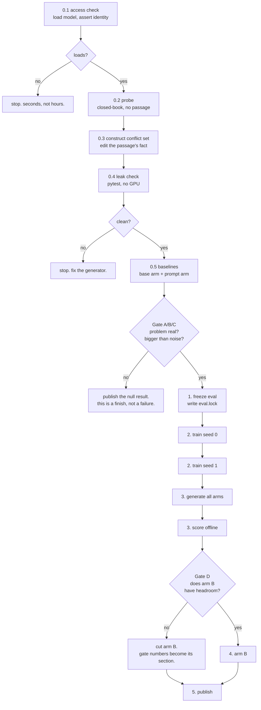
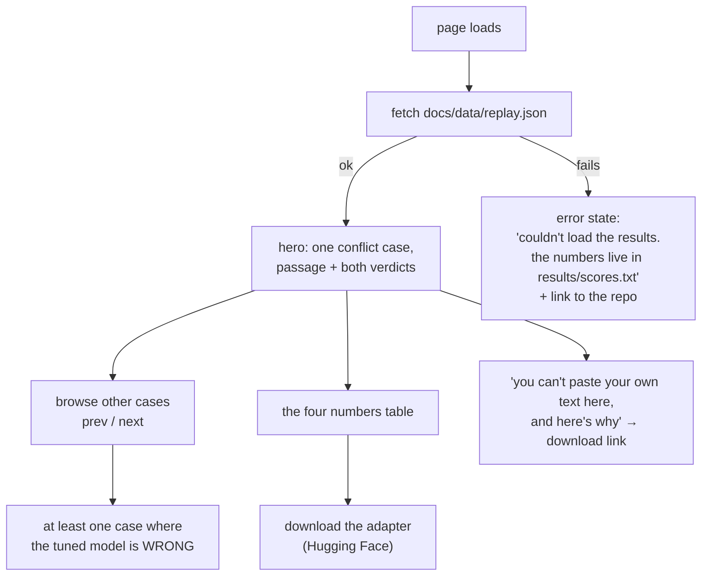

# APP FLOW — DEFER

Two journeys. The **pipeline**, which the author runs, and the **page**, which a
visitor opens. They meet at exactly one place: `runs/`.

---

## 1. The pipeline

Every stage is resumable. Re-running the entrypoint after a crash skips finished
stages and resumes the partial one — assume the orchestrator dies, because on a
free-tier notebook it will, usually without a traceback.



### Stage by stage

| # | command | consumes | emits | GPU |
|---|---|---|---|---|
| 0.2 | `defer-phase0-probe` on Kaggle (runs `ml/phase0.py`) | SQuAD 2.0 questions | `runs/probe/probe_{dev,train}.jsonl` | yes |
| 0.3 | folded into 1 -- `conflict.py` is a library, not a stage | probe records | conflict items | no |
| 0.4 | `python -m pytest ml/tests.py -q` | everything on disk | pass/fail | no |
| 1 | `python ml/build.py` | probe + SQuAD 2.0 | `data/eval.jsonl`, `data/eval.lock`, `data/train_mix.jsonl` | no |
| 0.5 | `defer-phase1-baselines` on Kaggle (runs `ml/phase1.py`) | `data/eval.jsonl` | `runs/base/`, `runs/prompt/` | yes |
| 2 | `python ml/train.py --seed 0` (then `--seed 1`) | `data/train_mix.jsonl` | adapter checkpoints | yes |
| 3 | the same baselines kernel, arms `defer_s0`/`defer_s1` | adapters + frozen eval | `runs/defer_s*/` | yes |
| 3 | `python ml/score.py` | `runs/`, `data/eval.lock` | `results/scores.txt`, `results/scores.json` | **no** |
| 5 | `python ml/build_replay.py` | `runs/` | `docs/data/replay.json` | no |

Stage 1 runs before stage 0.5 on purpose: the baselines are measured on the
frozen eval, so the eval has to exist and be locked first.

### How a Kaggle run actually happens

The notebooks are three-line stubs. All the logic lives in the `defer-code`
dataset they mount, because `kaggle kernels push` replaces the notebook and
starts a new version, while `kaggle datasets version` swaps the code underneath
a notebook that stays exactly where it was -- same settings, same history.

```bash
python ml/kernels/publish.py                 # stage, print the fingerprint
python ml/kernels/publish.py --push "why"    # upload a new dataset version
python -m kaggle kernels status johnandreimartinez/defer-phase1-baselines
python -m kaggle kernels output johnandreimartinez/defer-phase1-baselines -p runs/
```

`python -m kaggle` rather than plain `kaggle`: the console shim is not always on
PATH, and the module always is.

The first thing every run prints is a **code fingerprint** -- a short hash of the
`.py` files it actually imported. `publish.py` prints the same hash before
uploading. If the two differ, the notebook mounted an older dataset version and
its results are stale. Kaggle takes a minute or two to process a new version, so
starting the notebook too quickly is the usual cause.

The GPU is set by `"machine_shape": "NvidiaTeslaT4"` in `kernel-metadata.json`.
Without it Kaggle assigns a P100, which is compute capability sm_60 -- a chip
this PyTorch has no compiled code for. That failure does not appear at startup;
it appears at the first `generate()`, on the far side of a 6 GB model download.
`ml/kaggle_env.check_gpu()` moves it to second 5.

**The guards at the top of a run exist to be cheap.** A wrong model, an unusable
GPU, a stale code version or a truncated eval should end the session in seconds.
Putting the assert at the top of the expensive thing is the highest-value line in
the pipeline -- one of them caught a wrong-part launch in 55 seconds instead of
after hours of compute.

**Stage 3's scoring has no GPU column filled in on purpose.** Anyone can re-derive
every published number from the committed logs on a laptop. That is the difference
between a result and a claim.

### The paths people skip

- **Resume after a kill.** Re-run the same entrypoint. Finished stages are marked
  and skipped; the partial one restarts from its own last checkpoint. Never from
  zero.
- **Remote work finished but was never pulled.** The entrypoint checks for
  completed-but-unfetched outputs before starting anything new. Re-running eleven
  hours of GPU time because a poller died is the specific mistake being designed
  out.
- **Two orchestrators at once.** A lockfile. The second one exits with a message
  naming the first.
- **A prerequisite stage failed.** Dependent stages check their inputs exist and
  are non-empty, and refuse to start. Failing loudly beats training on an empty
  file for six hours.
- **The eval changed.** `eval.lock` mismatch, hard stop, no partial scoring.
- **Kaggle's own traps.** Read `~/.claude/KAGGLE-PLATFORM-NOTES.md` before the
  first run — the session cap, the 12-hour kill, and the way a new notebook
  version makes the previous run's output unreachable all apply here.

---

## 2. The page

Static HTML at `docs/index.html`. No build step, no framework, no server. A
visitor's whole journey is one page and one JSON file.



### Every state, including the ones that get skipped

| state | what the visitor sees |
|---|---|
| **loading** | the passage skeleton, not a spinner on an empty page — the layout must not jump when data lands |
| **loaded** | Exhibit A block, question, two stamped verdicts |
| **fetch failed** | plain sentence saying the results file did not load, plus the repo link where the raw numbers live. Never a blank page |
| **empty items** | "no cases published yet" — true during the period between the repo existing and the first run finishing |
| **stale replay** | the run hash is displayed; if it does not match what the README quotes, that is visible rather than silent |
| **arm B cut** | its section still exists, and says it was cut, with the gate numbers |
| **no JavaScript** | the headline sentence, the four-number table and the download link are in the HTML source, not injected. The interactive browsing degrades; the study does not disappear |
| **first visit, thirty seconds** | one conflict case is rendered by default. No click required to understand the project |

**The rule for the page: a stranger who reads nothing but the first screen should
be able to say what the project found.** If that needs a paragraph of explanation,
the design has failed, not the reader.
